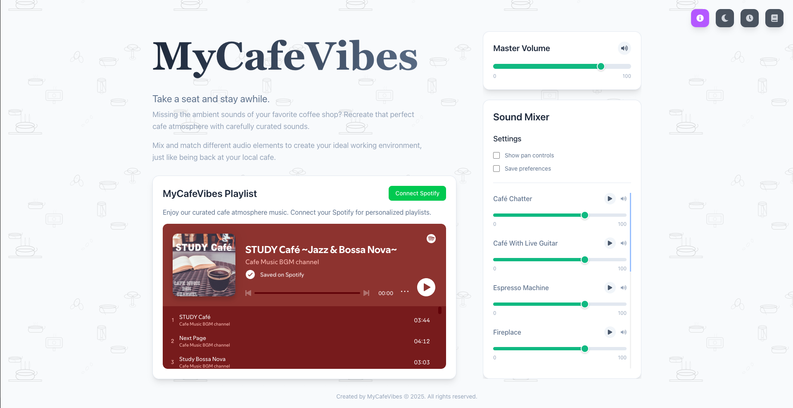
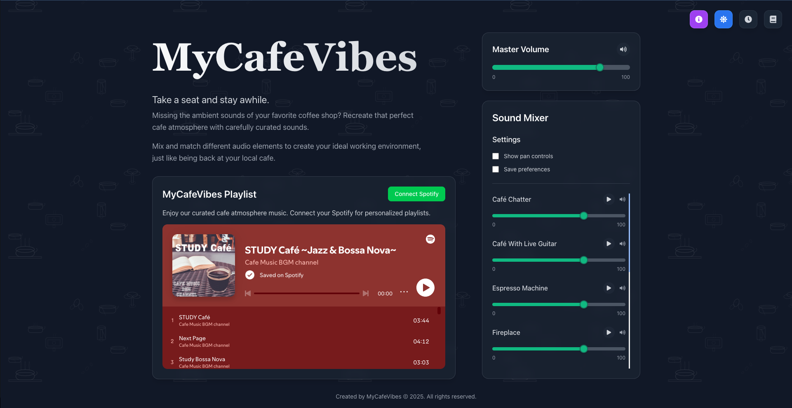
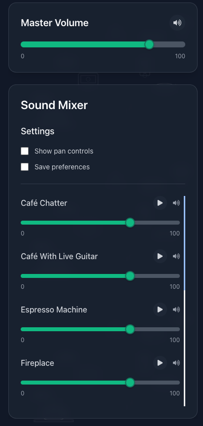
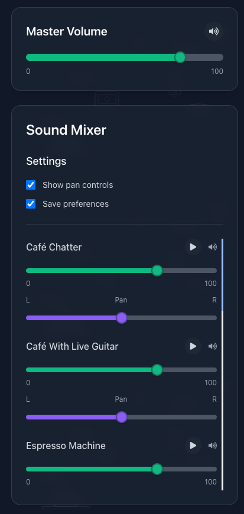
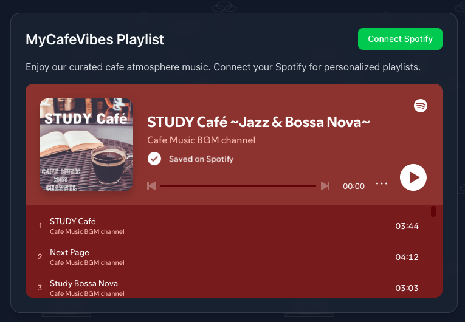
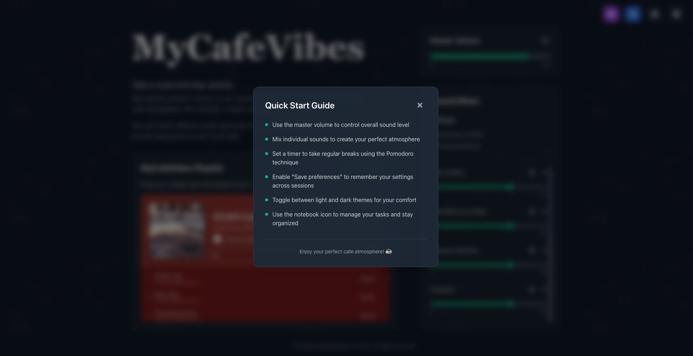
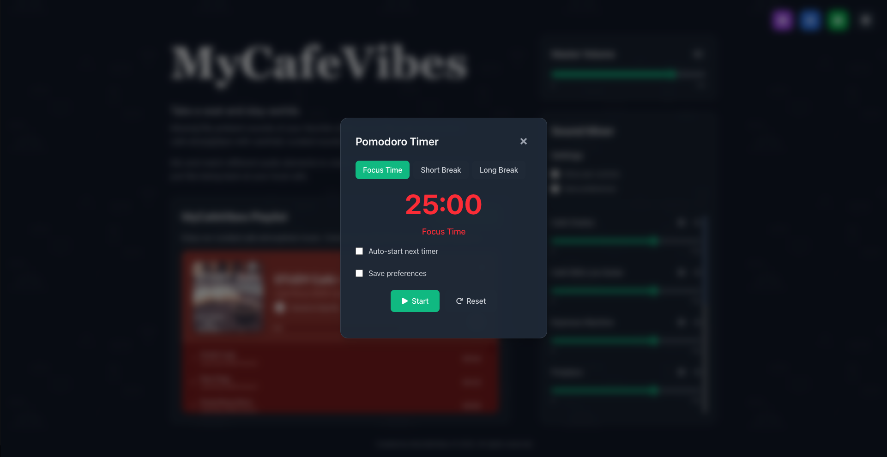
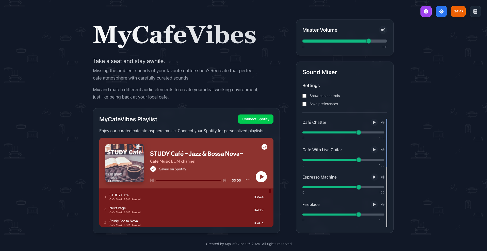
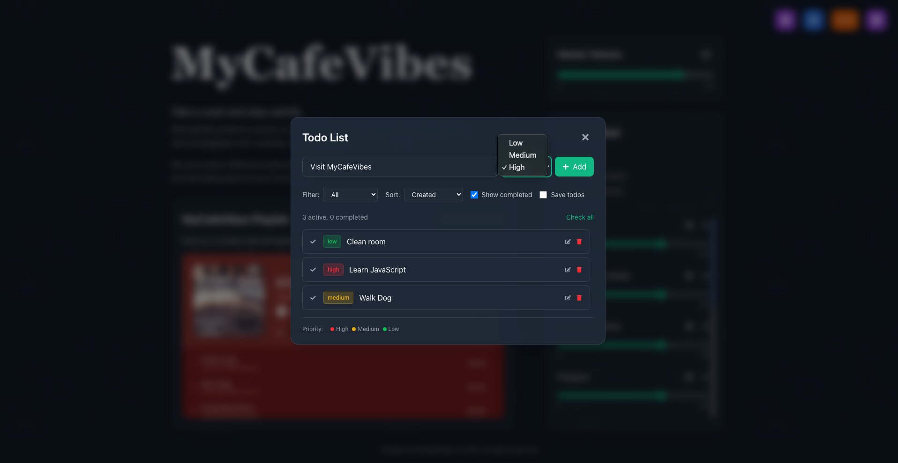

# MyCafeVibes ☕

**Take a seat and stay awhile.**

MyCafeVibes is a sophisticated ambient sound mixer and productivity companion that recreates the perfect cafe atmosphere for your workspace. Whether you're missing the ambient sounds of your favorite coffee shop or need a focused environment for deep work, MyCafeVibes provides carefully curated audio elements to enhance your productivity and well-being.




## ✨ Features

### 🌙 Dark Mode Support

MyCafeVibes features a beautiful dual-theme design that adapts to your preferences. The light mode offers a clean, minimalist interface perfect for daytime use, while the dark mode provides a cozy, eye-friendly experience ideal for evening work sessions. The theme automatically adjusts based on your system preferences or can be manually toggled.

### 🎵 Advanced Sound Mixer

Create your perfect cafe atmosphere with our sophisticated sound mixer featuring multiple ambient audio tracks:



- **Multiple Sound Sources**: Mix various cafe sounds including espresso machines, cafe chatter, live guitar, fireplace, rain, and more
- **Individual Volume Controls**: Fine-tune each sound element to your preference
- **Master Volume Control**: Adjust overall audio levels with precision
- **Pan Controls**: Position sounds in the stereo field for an immersive experience
- **Save Preferences**: Your custom sound configurations are automatically saved and restored



### 🎧 Spotify Integration

Seamlessly integrate your favorite music with ambient sounds:



- **Playlist Support**: Connect your Spotify account and play your favorite playlists
- **Background Music**: Layer your music with ambient cafe sounds
- **Volume Balancing**: Perfect balance between music and ambient audio
- **Default Playlist**: Pre-loaded with carefully curated cafe vibes playlist

### 📚 Quick Start Guide

New to MyCafeVibes? Our interactive quick start guide helps you get up and running in no time:



- **Step-by-step Tutorial**: Learn how to use all features effectively
- **Interactive Elements**: Click through different sections to understand functionality
- **Best Practices**: Discover optimal settings for different work scenarios
- **Tips & Tricks**: Expert advice for creating the perfect cafe atmosphere

### ⏰ Built-in Pomodoro Timer

Stay focused and productive with our integrated Pomodoro timer:



**Timer Features:**

- **Customizable Sessions**: Set work and break intervals to match your workflow
- **Visual Progress**: Clear countdown display with progress indicators
- **Session Tracking**: Monitor your productivity patterns
- **Break Reminders**: Gentle notifications when it's time to take a break
- **Compact Mode**: Minimize the timer while keeping track of your session



When minimized, the Pomodoro timer continues running in the background, showing the remaining time in a compact format so you can focus on your work while staying aware of your time management.

### ✅ Smart Todo List

Organize your tasks efficiently with our feature-rich todo list:



**Task Management Features:**

- **Priority Levels**: Mark tasks as high, medium, or low priority with color-coded indicators
- **Smart Sorting**: Organize tasks by priority, due date, or creation time
- **Quick Actions**: Add, edit, and complete tasks with intuitive controls
- **Persistent Storage**: Your tasks are automatically saved and synced
- **Clean Interface**: Minimalist design that doesn't distract from your work
- **Keyboard Shortcuts**: Navigate and manage tasks efficiently

## 🚀 Getting Started

### Prerequisites

- Node.js 18+
- npm, yarn, pnpm, or bun

### Installation

1. **Clone the repository**

   ```bash
   git clone https://github.com/yourusername/mycafevibes.git
   cd mycafevibes
   ```

2. **Install dependencies**

   ```bash
   npm install
   # or
   yarn install
   # or
   pnpm install
   ```

3. **Set up environment variables**
   Create a `.env.local` file in the root directory:

   ```env
   NEXT_PUBLIC_SPOTIFY_CLIENT_ID=your_spotify_client_id_here
   ```

4. **Run the development server**

   ```bash
   npm run dev
   # or
   yarn dev
   # or
   pnpm dev
   ```

5. **Open your browser**
   Navigate to [http://localhost:3000](http://localhost:3000) to start using MyCafeVibes.

## 🛠️ Built With

- **[Next.js 15](https://nextjs.org/)** - React framework for production
- **[React 19](https://reactjs.org/)** - UI library
- **[TypeScript](https://www.typescriptlang.org/)** - Type safety
- **[Tailwind CSS](https://tailwindcss.com/)** - Utility-first CSS framework
- **[Sass](https://sass-lang.com/)** - CSS preprocessor
- **[React Icons](https://react-icons.github.io/react-icons/)** - Icon library

## 🎯 Use Cases

- **Remote Work**: Create a professional cafe atmosphere in your home office
- **Study Sessions**: Enhance focus with ambient sounds during study time
- **Creative Work**: Boost creativity with carefully curated audio environments
- **Meditation**: Use gentle cafe sounds for relaxation and mindfulness
- **Productivity**: Combine Pomodoro technique with ambient audio for maximum efficiency

## 🤝 Contributing

We welcome contributions! Please feel free to submit a Pull Request. For major changes, please open an issue first to discuss what you would like to change.

## 📄 License

This project is licensed under the MIT License - see the [LICENSE](LICENSE) file for details.

## 🙏 Acknowledgments

- Inspired by the cozy atmosphere of local coffee shops
- Built with modern web technologies for the best user experience
- Designed for productivity and well-being

---

**Created by MyCafeVibes © 2025. All rights reserved.**

_Take a seat and stay awhile._ ☕
